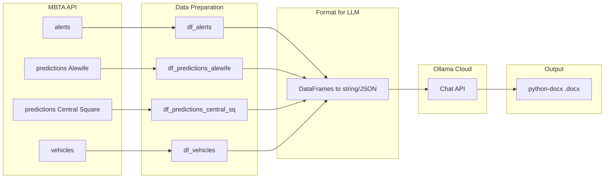

# AI Data Reporter Module Implementation Plan

## Summary of Requirements

From [Design Requirements Data Reporter.md](AI%20Data%20Reporter%20Module/Design%20Requirements%20Data%20Reporter.md):

- **Perspective**: Alewife → Central Square, Cambridge
- **Report sections**: Service alerts; next trains from Alewife (upcoming hour); on-time metrics; estimated time to destination
- **Output**: .docx Word file, max half page
- **Data**: Unfiltered (no Shiny app time-window or column subsetting); structured as dataframes per API call

## Architecture




---

## 1. File Structure and Dependencies

**Create** `AI Data Reporter Module/requirements.txt`:

- `requests`, `pandas`, `python-dotenv` (already used)
- `python-docx` for .docx output

---

## 2. Setup and Environment (Section 0)

- Load `.env` from `AI Data Reporter Module`, parent, or project root (path logic from [mbta_client.py](Shiny%20App/api/mbta_client.py))
- Require `MBTA_API_KEY` and `OLLAMA_API_KEY`
- Imports: `os`, `requests`, `pandas`, `Path`, `dotenv`, `Document` from `docx`, `json`

---

## 3. API Layer

Reuse/adapt the API helpers already in the stub (which mirror [mbta_client.py](Shiny%20App/api/mbta_client.py)). Add:


| Function                             | Endpoint       | Params                                                                    | Purpose                    |
| ------------------------------------ | -------------- | ------------------------------------------------------------------------- | -------------------------- |
| `fetch_alerts()`                     | `/alerts`      | `filter[route]=Red`                                                       | Service alerts             |
| `fetch_predictions_at_stop(stop_id)` | `/predictions` | `filter[stop]`, `filter[route]=Red`, `include=schedule,trip,stop,vehicle` | Alewife and Central Square |
| `fetch_vehicles()`                   | `/vehicles`    | `filter[route]=Red`, `include=trip,stop`                                  | Vehicle positions          |


**Stop IDs**: Alewife `place-alfcl`, Central Square `place-cntsq`

---

## 4. Data Preparation (Unfiltered, Full DataFrames)

Build one DataFrame per API response. **Do not** apply Shiny app filters (no 10/60 min windows, no direction-only subsetting, no description truncation).

### 4.1 Alerts DataFrame (`df_alerts`)

- All Red Line alerts from `fetch_alerts()`
- Columns: all useful attributes (id, severity, header, short_header, description, created_at, updated_at, active_period as JSON string, etc.) — no truncation
- Use `_build_included_lookup` pattern only if alerts have includes; typically alerts are self-contained

### 4.2 Predictions at Alewife (`df_predictions_alewife`)

- Call `fetch_predictions_at_stop("place-alfcl")`
- Flatten JSON:API: for each prediction in `data`, join attributes from `included` (schedule, trip, stop, vehicle)
- Keep **all** predictions (both directions: departures and arrivals)
- Columns: prediction id, direction_id, departure_time, arrival_time, schedule departure/arrival, trip headsign, stop name, vehicle_id, etc.
- No time-window filtering; include full attribute set

### 4.3 Predictions at Central Square (`df_predictions_central_sq`)

- Call `fetch_predictions_at_stop("place-cntsq")`
- Same flattening logic as Alewife
- Used for "estimated time to destination" (southbound trains arriving at Central Square)

### 4.4 Vehicles DataFrame (`df_vehicles`)

- From `fetch_vehicles()`
- Flatten: join trip (headsign, direction_id) and stop (name) from `included`
- Columns: vehicle id, latitude, longitude, bearing, current stop name, trip headsign, direction_id, etc.

### 4.5 Flattening Pattern

Use the `_build_included_lookup` approach from [parsers.py](Shiny%20App/api/parsers.py) (lines 90–96), then for each main resource resolve related IDs and add columns. Preserve raw IDs and full ISO timestamps.

---

## 5. Format Data for Ollama

- Convert each DataFrame to a machine-readable string (e.g. `.to_json(orient="records", date_format="iso")` or `.to_csv()`)
- Combine into a single context string with clear section headers, e.g. `"## Alerts\n{df_alerts_json}\n\n## Predictions Alewife\n{...}"`
- Use a variable `PROMPT_PLACEHOLDER` or `USER_PROMPT = ""` for the prompt text; user fills this separately
- Final message: `PROMPT_PLACEHOLDER + "\n\n---\nData:\n" + formatted_data`

---

## 6. Ollama Cloud Query

Follow [EXAMPLE_ollama_cloud.py](AI%20Data%20Reporter%20Module/EXAMPLE_ollama_cloud.py):

```python
url = "https://ollama.com/api/chat"
headers = {
    "Authorization": f"Bearer {OLLAMA_API_KEY}",
    "Content-Type": "application/json"
}
body = {
    "model": "gpt-oss:20b-cloud",  # or make configurable
    "messages": [
        {"role": "user", "content": <prompt + formatted data>}
    ],
    "stream": False
}
response = requests.post(url, headers=headers, json=body)
result = response.json()
report_text = result["message"]["content"]
```

Handle errors (missing key, non-200, invalid JSON).

---

## 7. Write Report to .docx

Using `python-docx`:

- Create `Document()`
- Add report content: `document.add_paragraph(report_text)` or split by newlines into paragraphs
- Optionally add a title and timestamp
- Save to configurable path (e.g. `reports/mbta_commute_report_{timestamp}.docx`)

---

## 8. Main Flow and Placeholder

```python
# Main execution flow
def main():
    # 1. Fetch all API data
    # 2. Build unfiltered dataframes
    # 3. Format for Ollama
    # 4. Build message: USER_PROMPT + "\n\n" + formatted_data
    # 5. Call Ollama Cloud
    # 6. Write response to .docx
```

**Placeholder for prompt**: Define at top of script:

```python
# User fills prompt below; data will be appended automatically
USER_PROMPT = """
[User will provide instructions for the LLM here.]
"""
```

---

## 9. Key Differences from Shiny App


| Aspect         | Shiny App                                                           | Data Reporter                                    |
| -------------- | ------------------------------------------------------------------- | ------------------------------------------------ |
| Predictions    | Only direction_id 0 (departures) or 1 (arrivals); 10/60 min windows | All predictions, both directions, no time filter |
| Alerts         | Description truncated to 200 chars                                  | Full description and attributes                  |
| Output         | DataGrid tables                                                     | DataFrames → string → Ollama → .docx             |
| Central Square | Not used                                                            | Predictions at `place-cntsq` for destination ETA |


---

## 10. Files to Create/Modify


| Action    | Path                                       |
| --------- | ------------------------------------------ |
| Create    | `AI Data Reporter Module/requirements.txt` |
| Build out | `AI Data Reporter Module/data_reporter.py` |


---

## 11. Coding Style

Per [.cursor/rules/coding_style.mdc](.cursor/rules/coding_style.mdc): header block, section comments (`# 0. Setup`, `# 1. API`, etc.), lowercase_with_underscores, pandas for data, liberal comments.