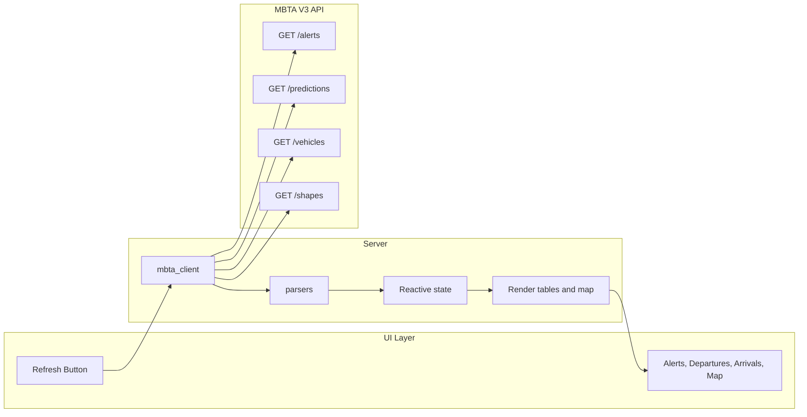

# Python Shiny App – Development Sprint Plan

## Scope Summary

Deliver a single Shiny for Python application under [Shiny App/](Shiny App/) that:

- Runs MBTA V3 API queries **on user request** (button-triggered).
- Shows **Service Alerts**, **Departures** (from Alewife), **Near-term Arrivals** (10 min), **Future Arrivals** (60 min), and a **Live Map** (train positions + direction on a satellite-style map with Red Line route).
- Handles **errors** (missing API key, API failures, invalid inputs).
- Uses a **clean file tree**, project **coding style**, and two **READMEs** (developer + Cursor-oriented).

Reuse and adapt logic from [000_RedLineTrackerProject/pullDataAndParse.py](000_RedLineTrackerProject/pullDataAndParse.py) and the API pattern in [000_RedLineTrackerProject/API Call Demo.py](000_RedLineTrackerProject/API Call Demo.py). Follow [.cursor/plans/alewife_red_line_api_implementation.md](.cursor/plans/alewife_red_line_api_implementation.md) for endpoints and parsing.

---

## Architecture and Data Flow




- **app.py**: Single entry point; defines `App(ui=..., server=...)`, `run_app()`, layout (sidebar + main content), and wires reactive refresh to API + parsers + outputs.
- **api/mbta_client.py**: Environment (`.env` via `python-dotenv`), `BASE_URL`, `HEADERS`; functions that return raw JSON (or raise / return errors) for alerts, predictions, vehicles, and shapes.
- **api/parsers.py**: Pure functions that take API responses and return pandas DataFrames (alerts, departures, near-term arrivals, future arrivals, vehicle positions for map, and Red Line shape geometry). Logic ported from `pullDataAndParse.py` (strip debug `#region` blocks).
- **Live Map**: Use **Vehicles** response for train lat/lon and direction (MBTA V3 Vehicle resource; if position not in REST response, fallback to MBTA GTFS-Realtime feed and document in README). Use **Shapes** endpoint (`filter[route]=Red`) for Red Line route geometry. Render with **Plotly (mapbox)** via **shinywidgets** (`output_widget` / `render_widget`) for an interactive satellite-style basemap, route line(s), and vehicle markers with direction indicators.

---

## Suggested File Tree

```
Shiny App/
├── app.py                 # Main app: ui, server, run_app()
├── requirements.txt       # shiny, pandas, requests, python-dotenv, plotly, shinywidgets
├── .env.example            # MBTA_API_KEY= (no real key)
├── README.md               # Developer + Cursor README (both formats)
└── api/
    ├── __init__.py
    ├── mbta_client.py      # API calls, env, error handling
    └── parsers.py          # Response -> DataFrames (alerts, departures, arrivals, map data)
```

Optional later: `ui/components.py` for reusable cards/panels if the single-file UI grows.

---

## Sprint Breakdown

### 1. Project setup and dependencies

- Create [Shiny App/](Shiny App/) subfolder **api/** with `__init__.py`.
- Add **requirements.txt**: `shiny`, `pandas`, `requests`, `python-dotenv`, `plotly`, `shinywidgets` (and versions for reproducibility).
- Add **.env.example** with `MBTA_API_KEY=` and brief comment; document in README that users copy to `.env` and obtain a key from MBTA.

### 2. API layer (mbta_client.py)

- Load env from `.env` (project root or `Shiny App/`); read `MBTA_API_KEY`; build `HEADERS` and `BASE_URL`.
- Expose:
  - `fetch_alerts()` → alerts JSON or error.
  - `fetch_predictions()` → predictions with `include=schedule,trip,stop,vehicle`.
  - `fetch_vehicles()` → vehicles with `include=trip,stop`.
  - `fetch_shapes(route_id="Red")` (or filter by Red Line route ID) → shapes JSON for map.
- On missing key or non-2xx response, return a structured error (e.g. dict with `error`, `message`) or raise a clear exception that the server will catch and show in the UI.
- Use same params as [API Call Demo.py](000_RedLineTrackerProject/API Call Demo.py) and [alewife_red_line_api_implementation.md](.cursor/plans/alewife_red_line_api_implementation.md).

### 3. Parsing layer (parsers.py)

- Port logic from [pullDataAndParse.py](000_RedLineTrackerProject/pullDataAndParse.py) into pure functions (no `globals().clear()` or print):
  - **Alerts**: severity map, active_period → Status (Active/Inactive), columns: Severity, Description, Start Time, End Time, Status.
  - **Predictions + included**: build included lookup; split by `direction_id` (0 = departures, 1 = arrivals); derive Status (On Time/Delayed/Cancelled) from scheduled vs predicted time.
  - **Departures**: Destination, Scheduled Departure Time, Actual Estimated Departure Time, Status.
  - **Arrivals**: vehicle_id, Scheduled/Actual Estimated Arrival Time, Status, then join **vehicle_id → current_stop** from vehicles response; filter by 10 min and 60 min windows (UTC).
  - **Map**: From vehicles response, build DataFrame or list of dicts: vehicle id, latitude, longitude, bearing/direction; from shapes response, extract Red Line geometry (lat/lon sequence) for drawing the route.
- Handle empty responses (empty DataFrames with correct columns).
- Remove any debug logging (`#region agent log`) from ported code.

### 4. Live Map data and API

- In **mbta_client**: ensure **vehicles** request returns data that can include position (MBTA V3 Vehicle attributes; if not present, document in README that GTFS-Realtime may be needed for true “live” positions and add a short “Future: GTFS-RT” note).
- In **parsers**: add `parse_vehicles_for_map(vehicles_response)` and `parse_red_line_shape(shapes_response)` returning structures suitable for Plotly (e.g. list of (lat, lon, direction) for trains; list of (lat, lon) for route line).
- **Shapes**: use MBTA route ID for Red (e.g. `filter[route]=Red` or the correct route id from `/routes`); parse shape points for Red Line only.

### 5. App UI (app.py)

- Use **layout_sidebar**: sidebar with a single primary control—“Refresh” or “Run API query” button—and brief instructions; main area for content.
- Main content: **navset_card_tab** (or equivalent) with panels:
  - **Service Alerts** (table).
  - **Departures** (table).
  - **Near-term Arrivals** (table).
  - **Future Arrivals** (table).
  - **Live Map** (one panel with map widget).
- Use **output_ui** or **output_data_frame** for tables (formatted, clear headers); use **shinywidgets** `output_widget` for the map.
- Apply a clean Shiny theme and spacing (e.g. `bslib` if available in Shiny for Python or built-in theme) for an attractive, modern look; good typography and spacing as required.

### 6. Server logic (app.py)

- One reactive flow triggered by the refresh button:
  - Call mbta_client for alerts, predictions, vehicles, shapes (in sequence or in parallel where independent).
  - If any call fails (missing key, HTTP error): show a single user-facing error message (e.g. in a card at top or in each affected panel).
  - Otherwise run parsers and store results in reactive values (e.g. `@reactive.Calc` or event-driven reactive values updated on button click).
- **Render**:
  - Alerts / Departures / Near-term / Future: render DataFrames as tables (format datetimes for display).
  - Live Map: `@render_widget` returning a Plotly figure (mapbox style satellite, Red Line shape as line, vehicle positions as markers with direction).
- **Error handling**: catch missing API key, 4xx/5xx, and invalid/empty data; display clear messages in the UI (no stack traces to end user).

### 7. Live Map component

- Build a Plotly figure:
  - **Basemap**: Mapbox satellite (or satellite-streets) via `layout.mapbox.style`.
  - **Red Line**: add trace(s) for shape geometry (line).
  - **Trains**: scatter or symbol trace with lat/lon and direction (e.g. rotation or arrow symbols).
- Return this figure from the render function for the map panel; ensure it updates when “Refresh” is clicked (reactive to the same data that fills the tables).
- Boston metro bounds: set map center/zoom so the Red Line and Alewife area are visible by default.

### 8. Error handling and edge cases

- **Missing API key**: detect before calling API; show message like “Set MBTA_API_KEY in .env.”
- **API errors**: on non-200, show short message (e.g. “API request failed: status X”) and leave previous data or empty tables.
- **Invalid/empty responses**: parsers return empty DataFrames with correct columns; UI shows “No data” or empty table instead of crashing.
- **Input controls**: requirements ask for “input controls for query parameters (if applicable)”; for this sprint, the only user input is “Run query.” Optional: add a simple control (e.g. station or time window) later; if not added, state in README that the app uses fixed parameters (Alewife, 10/60 min).

### 9. Styling and UX

- Use consistent spacing, readable fonts, and a limited color palette.
- Ensure tables are readable (headers, alignment, optional row striping).
- Match project style: [.cursor/rules/coding_style.mdc](.cursor/rules/coding_style.mdc) (Python: pandas, section headers, comments, variable naming).

### 10. Documentation

- **README.md** in [Shiny App/](Shiny App/):
  - Follow [.cursor/rules/developer_readme_format.mdc](.cursor/rules/developer_readme_format.mdc): TOC, Overview, Installation, How to run, API requirements (API key, link to MBTA), Screenshots (placeholders or real after run), Usage.
  - Add a **Cursor-oriented** section per [.cursor/rules/cursor_readme_format.mdc](.cursor/rules/cursor_readme_format.mdc): project summary, repo layout (Shiny App folder and files), tech stack, entry point (`shiny run app.py` from Shiny App), conventions (coding_style), env (`.env`, `MBTA_API_KEY`), links to MBTA API and Shiny docs.
  - Keep one README that satisfies both “developer” and “Cursor” requirements; self-consistent and updated with any later changes.

### 11. Verification

- App starts with `shiny run app.py` from the Shiny App directory (or equivalent).
- UI renders (sidebar, tabs, tables, map placeholder or full map).
- Click “Refresh”: API runs; Alerts, Departures, Near-term, Future tables populate (or show “No data” when empty).
- Live Map shows Red Line and vehicle positions when data is available.
- Missing key or broken API: user sees a clear error message, no crash.
- README instructions match actual run steps and env setup.

---

## Key Files to Leverage


| Purpose                            | Source                                                                                                                                                                   |
| ---------------------------------- | ------------------------------------------------------------------------------------------------------------------------------------------------------------------------ |
| API endpoints and params           | [API Call Demo.py](000_RedLineTrackerProject/API Call Demo.py), [alewife_red_line_api_implementation.md](.cursor/plans/alewife_red_line_api_implementation.md)           |
| Alerts/Departures/Arrivals parsing | [pullDataAndParse.py](000_RedLineTrackerProject/pullDataAndParse.py) (lines 77–272, 239–272 for vehicles→current_stop and time filters)                                  |
| Coding style                       | [.cursor/rules/coding_style.mdc](.cursor/rules/coding_style.mdc)                                                                                                         |
| README structure                   | [.cursor/rules/developer_readme_format.mdc](.cursor/rules/developer_readme_format.mdc), [.cursor/rules/cursor_readme_format.mdc](.cursor/rules/cursor_readme_format.mdc) |


---

## Risks and Mitigations

- **Vehicle position in MBTA V3**: If the REST Vehicle resource does not include latitude/longitude, the Live Map will need MBTA’s GTFS-Realtime feed (different client). Mitigation: implement map with whatever position data V3 provides; document in README and add a short “Future: use GTFS-RT for live positions” if needed.
- **Shapes API**: Red Line may have multiple shapes (e.g. Ashmont vs Braintree). Parsers should handle multiple shapes and draw all or the main ones; document behavior in README.

---

## Out of Scope for This Sprint

- Authentication beyond API key in env.
- Persistence (e.g. database); data is fetched on demand only.
- Streamlit (requirements specify Shiny).
- Non–Red Line routes or configurable stations (can be added later per README).

---

## Deliverables Checklist

- Main app file **app.py** in Shiny App/
- **api/mbta_client.py** and **api/parsers.py**
- **requirements.txt** and **.env.example**
- **README.md** (developer + Cursor, screenshots, usage, API setup)
- Clean file tree; no unnecessary files
- App runs, UI displays, API runs on button click, results and map display, errors handled gracefully

