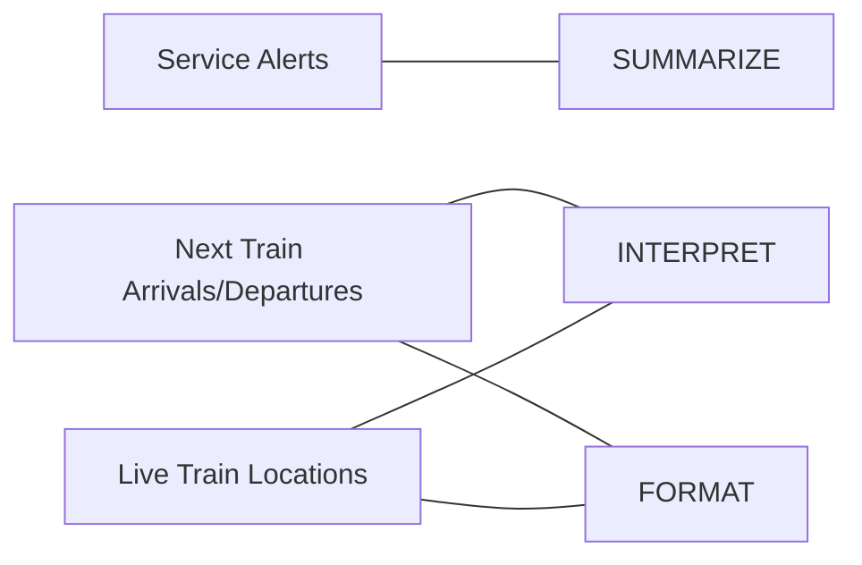

SYSEN 5381 Spring 2026

Jonathan Lloyd

My Tool: Boston MBTA Red Line Train Tracker

Stakeholders:

* Commuter: needs to know of any service alerts or delays en route
* Student: needs to know when the next trains will be to time apartment departure perfectly
* Roommate: needs to know when to start cooking based on train distance

System goals:

* SUMMARIZE
* INTERPRET
* FORMAT

Mermaid Process Diagram

