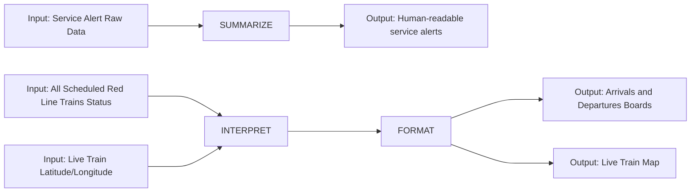

Mermaid Process Diagram

```mermaid
graph LR
    A[Input: Service Alert Raw Data]
    A1[Output: Human-readable service alerts]
    B[Input: All Scheduled Red Line Trains Status]
    B1[Output: Arrivals and Departures Boards]
    C[Input: Live Train Latitude/Longitude]
    C1[Output: Live Train Map]

    A ---> SUMMARIZE ---> A1
  
    B ---> INTERPRET ---> FORMAT 
    C ---> INTERPRET 
    FORMAT ---> B1
    FORMAT ---> C1
```
