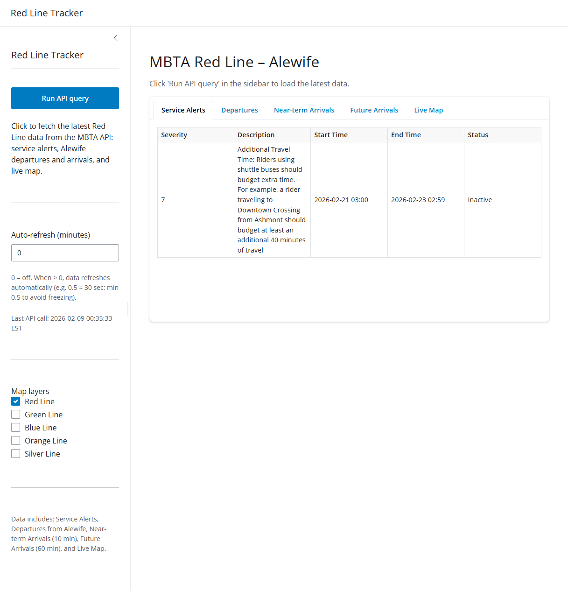
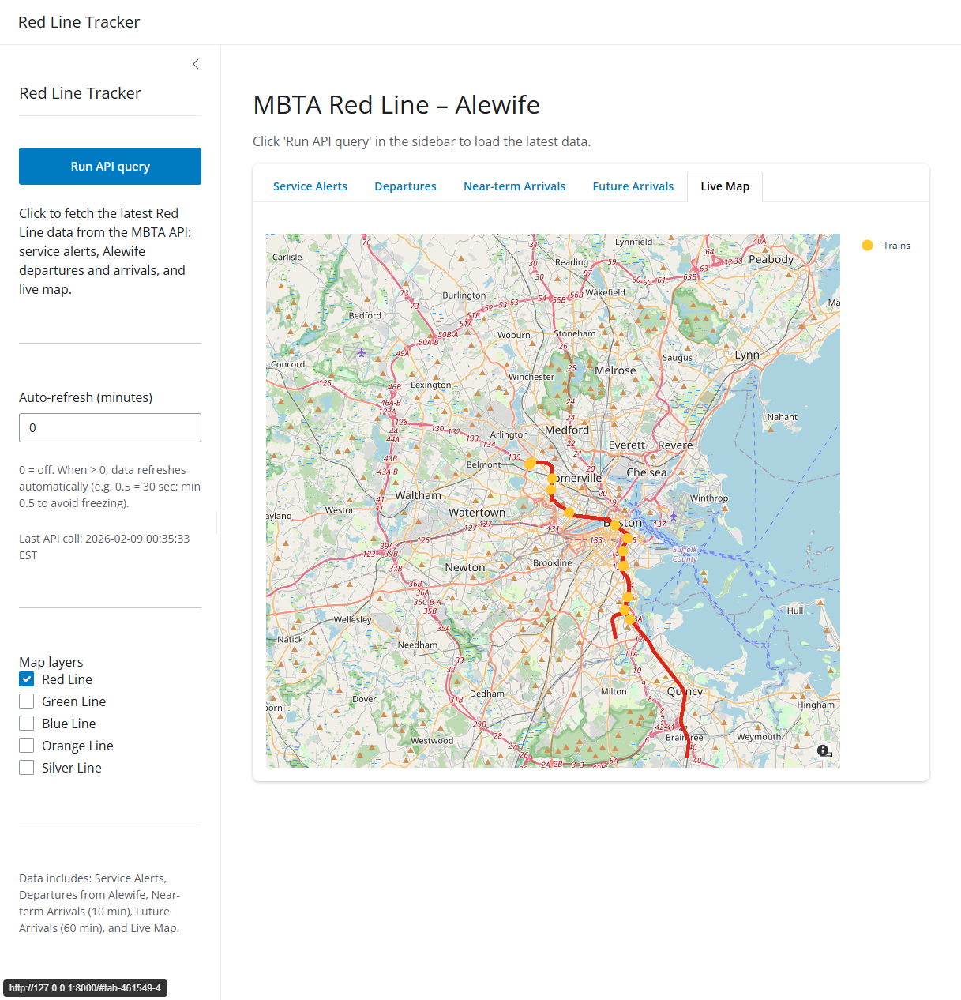

# MBTA Red Line Tracker (Shiny App)

Python Shiny app that queries the MBTA V3 API and displays Red Line service alerts, Alewife departures and arrivals, and a live map of trains and routes. All displayed times are in Eastern time.

## Table of Contents

- [Overview](#overview)
- [Requirements](#requirements)
- [Installation](#installation)
- [How to run](#how-to-run)
- [API requirements](#api-requirements)
- [Usage](#usage)
- [Screenshots](#screenshots)
- [Tech stack](#tech-stack)
- [Conventions](#conventions)

## Overview

The app fetches Red Line data when you click **Run API query** or on an optional auto-refresh interval. It shows:

- **Service Alerts** — Severity, description, start/end time, active or inactive.
- **Departures** — From Alewife: destination, scheduled/estimated departure, status (On Time / Delayed / Cancelled), soonest first.
- **Near-term Arrivals** — To Alewife in the next 10 minutes: current stop, scheduled/estimated arrival, status.
- **Future Arrivals** — To Alewife in the next 60 minutes: same columns.
- **Live Map** — Route layers (Red by default; Green, Blue, Orange, Silver toggled via sidebar). All branches per line (e.g. both Red branches, all Green branches). Train markers with direction indicator and hover: Train ID, direction, destination, next station, expected time at next station, minutes behind. Map layer visibility is controlled only by the sidebar checkboxes; route traces are not shown in the plot legend.

Display times are in **Eastern time**. Auto-refresh accepts fractional minutes (e.g. 0.5 = 30 seconds); minimum 0.5 minutes is enforced to avoid UI freezing. Errors (missing API key, API failures) appear in a banner at the top.

## Requirements

- Python 3.9+
- MBTA API key (see [API requirements](#api-requirements))

## Installation

1. Open a terminal in the `Shiny App` folder (or repo root then `cd "Shiny App"`).
2. Create a virtual environment (recommended):

   ```bash
   python -m venv .venv
   .venv\Scripts\activate   # Windows
   # or: source .venv/bin/activate   # macOS/Linux
   ```

3. Install dependencies:

   ```bash
   pip install -r requirements.txt
   ```

4. Copy `.env.example` to `.env` and set your MBTA API key (see below).

## How to run

From the **Shiny App** directory:

```bash
shiny run app.py
```

Optional: open in browser and auto-reload on save:

```bash
shiny run app.py --reload --launch-browser
```

The app is served at `http://127.0.0.1:8000` by default.

## API requirements

- **MBTA API key** is required. Get one at the [MBTA Developer Portal](https://api-v3.mbta.com/portal).
- Copy `.env.example` to `.env` in the `Shiny App` folder (or repo root) and set:

  ```bash
  MBTA_API_KEY=your_key_here
  ```

- The app uses the [MBTA V3 API](https://api-v3.mbta.com/docs/swagger/index.html) endpoints: `/alerts`, `/predictions`, `/vehicles`, `/shapes`.

## Usage

1. Run the app (see [How to run](#how-to-run)).
2. Click **Run API query** in the sidebar to fetch data, or set **Auto-refresh (minutes)** to a value ≥ 0.5 (e.g. 0.5 for 30 s, 1 for 1 min).
3. Use the tabs for Service Alerts, Departures, Near-term Arrivals, Future Arrivals, and Live Map.
4. On the map: use **Map layers** to show Red only (default) or add Green, Blue, Orange, Silver. Hover over train markers for details. Direction is shown by a short line on each train marker.

Fixed parameters: Red Line, Alewife stop (`place-alfcl`), 10-minute window for near-term arrivals, 60-minute for future arrivals. API times are interpreted as America/New_York when naive, then converted for filtering and displayed in Eastern.

## Screenshots

**Sidebar and Service Alerts tab** — Run API query, auto-refresh, map layers, and a table of alerts (times in Eastern).



**Live Map tab** — Red Line route and train positions; map layers are toggled in the sidebar only.



## Tech stack

- **Python**: 3.9+. Dependencies: `pip install -r requirements.txt` from the `Shiny App` folder.
- **Shiny for Python**: [Shiny](https://shiny.posit.co/py/docs/install-create-run.html), [Layouts](https://shiny.posit.co/py/layouts/).
- **Map**: [Plotly](https://plotly.com/python/) via [shinywidgets](https://shiny.posit.co/py/packages/shinywidgets/) (`output_widget` / `render_widget`). Route geometry from MBTA `/shapes` (encoded polyline decoded with the `polyline` package).
- **Environment**: `.env` in `Shiny App` or repo root; variable `MBTA_API_KEY`. Do not commit `.env`.

## Conventions

- Follow [`.cursor/rules/coding_style.mdc`](../.cursor/rules/coding_style.mdc) for Python (section headers, comments, pandas, naming).
- API logic lives in `api/`; app layout and reactivity in `app.py`. Parsers are pure functions (no side effects).

**For Cursor / AI-assisted editing:** See [README_CURSOR.md](README_CURSOR.md) for project structure, entry points, and conventions used as context when generating or modifying code.
