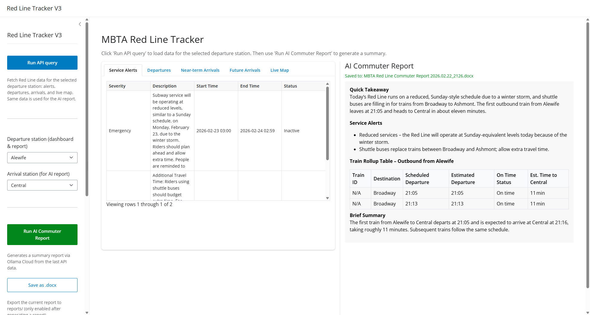

# MBTA Red Line Tracker V3 (Shiny App)

Python Shiny app that queries the MBTA V3 API for Red Line data and displays service alerts, departures/arrivals for a selected station, a live map, and an optional AI Commuter Report (Ollama Cloud). All displayed times are in Eastern time.

## Table of Contents

- [Overview](#overview)
- [Requirements](#requirements)
- [Installation](#installation)
- [How to run](#how-to-run)
- [Configuration](#configuration)
- [Usage](#usage)
- [Screenshots](#screenshots)
- [Deployment](#deployment)
- [Tech stack](#tech-stack)
- [Project structure](#project-structure)
- [Conventions](#conventions)

## Overview

- **Run API query** fetches data for the **selected departure station** (default Alewife) and **selected arrival station** in one go. The same snapshot is used for the dashboard and for the AI report.
- **Station dropdowns** include all Red Line stations (Alewife through JFK/UMass, then Ashmont branch and Braintree branch) with non-selectable group labels so you can pick any dep/arr pair.
- **Report–data match**: If you change the departure or arrival station after the last API query and then click **Run AI Commuter Report**, the app refreshes data for the current selection before calling Ollama, so the report always uses data for the requested stations.
- **Dashboard (left panel)**: Service Alerts, Departures, Near-term Arrivals (10 min), Future Arrivals (60 min), and Live Map. Use the **Left panel width %** slider to resize. Layout uses viewport-relative heights so it fills the window.
- **AI Commuter Report (right panel)**: Click **Run AI Commuter Report** to generate a summary via Ollama Cloud. The report is shown in Markdown with grid-lined tables. **Save as .docx** exports to `reports/` with naming `MBTA Red Line Commuter Report YYYY.MM.DD_HHMM.docx` (Eastern time).
- Progress indicators appear when you click Run API query, Run AI Commuter Report, or Save as .docx, and disappear when the action completes.
- Environment variables are loaded from **repo root `.env` first**, then from this app folder.

## Requirements

- Python 3.9+
- MBTA API key and (for AI report) Ollama API key — see [Configuration](#configuration)

## Installation

1. Open a terminal in the `Shiny App V3` folder (or repo root then `cd "Shiny App V3"`).
2. Create a virtual environment (recommended):
  ```bash
   python -m venv .venv
   .venv\Scripts\activate   # Windows
   # or: source .venv/bin/activate   # macOS/Linux
  ```
3. Install dependencies:
  ```bash
   pip install -r requirements.txt
  ```
4. Copy `.env.example` to `.env` (in repo root or this folder) and set your API keys (see [Configuration](#configuration)).

## How to run

From the **Shiny App V3** directory:

```bash
shiny run app.py
```

Optional: open in browser and auto-reload on save:

```bash
shiny run app.py --reload --launch-browser
```

The app is served at `http://127.0.0.1:8000` by default.

## Configuration

- **MBTA API key** (required): Get one at the [MBTA Developer Portal](https://api-v3.mbta.com/portal).
- **OLLAMA_API_KEY** (required for AI report): From [Ollama](https://ollama.com).
- Copy `.env.example` to `.env` in the **repo root** or in `Shiny App V3`. The app loads **repo root first**, then app dir:
  ```bash
  MBTA_API_KEY=your_key_here
  OLLAMA_API_KEY=your_ollama_key_here
  ```
- Do not commit `.env`.

## Usage

1. Run the app (see [How to run](#how-to-run)).
2. Choose **Departure station** and **Arrival station** from the dropdowns (grouped: Alewife→JFK/UMass, Ashmont branch, Braintree branch).
3. Click **Run API query** to fetch data. Tables and map use the departure station; both dep and arr data are cached for the AI report.
4. Use the tabs for Service Alerts, Departures, Near-term Arrivals, Future Arrivals, and Live Map. Adjust **Left panel width %** to resize the split.
5. Click **Run AI Commuter Report**. If the current dep/arr differ from the data in the cache, the app fetches fresh data for the selected stations first, then generates the report.
6. Click **Save as .docx** to export the current report to `reports/` (only enabled after a report is generated).

## Screenshots

- **Sidebar and split layout** — Run API query, station dropdowns (grouped), Run AI Commuter Report, Save as .docx, panel ratio, map layers.

  

- **AI Commuter Report** — Markdown report with grid-lined tables in the right panel.

  

- **Live Map** — Red Line and optional other routes, train positions.

  

## Deployment

- **Docker**: From `Shiny App V3`, run `docker build -t redline-v3 .` then run the container with `MBTA_API_KEY` and `OLLAMA_API_KEY` set. The app listens on port 8000.
- **Digital Ocean**: Use the [.do/app.yaml](.do/app.yaml) spec; set source directory to `Shiny App V3` and add both API keys as secrets.

## Tech stack

- **Python**: 3.9+. Dependencies: `pip install -r requirements.txt` from `Shiny App V3`.
- **Shiny for Python**: [Shiny](https://shiny.posit.co/py/docs/install-create-run.html). ExtendedTask for non-blocking AI report; cache passed into task (no reactive reads in threads).
- **Map**: [Plotly](https://plotly.com/python/) via [shinywidgets](https://shiny.posit.co/py/packages/shinywidgets/). Route geometry from MBTA `/shapes` (polyline decoded with `polyline`).
- **AI report**: Ollama Cloud API; report text to Word via `python-docx`. Report tables styled with CSS grid lines.
- **Environment**: `.env` loaded from repo root first, then app dir (`MBTA_API_KEY`, `OLLAMA_API_KEY`).

## Project structure

Paths are relative to **Shiny App V3** unless noted.

- `**app.py`** — Main entry. Sidebar (Run API query, grouped dep/arr dropdowns, Run AI report, Save .docx, panel ratio, map layers), split layout (tabs + report panel with viewport-relative heights), reactive state, `api_cache_stations` for report–data match, ExtendedTask for AI report.
- `**api/mbta_client.py**` — MBTA V3 client; `fetch_predictions_at_stop(stop_id)` for dep/arr; loads `.env` from repo root first.
- `**api/parsers.py**` — Pure parsers for alerts, departures, arrivals, map data.
- `**ai_reporter/reporter.py**` — Build DFs from API responses, compact format for Ollama, `query_ollama_cloud`, `write_report_docx` (Eastern-time filename).
- `**ui/layout.py**` — `RED_LINE_STOPS`, `RED_LINE_STOPS_GROUPED` (optgroups: Alewife→JFK/UMass, Ashmont branch, Braintree branch), `make_station_dropdowns()`, `get_station_name()`.
- `**reports/**` — Created at runtime for .docx output (gitignored).
- `**requirements.txt**`, `**.env.example**`, `**Dockerfile**`, `**.do/app.yaml**`.

## Conventions

- Follow `[.cursor/rules/coding_style.mdc](../.cursor/rules/coding_style.mdc)` for Python.
- API and parsing in `api/`; AI report in `ai_reporter/`; UI helpers in `ui/`.

**For Cursor / AI-assisted editing:** See [README_CURSOR.md](README_CURSOR.md) for structure, entry points, and conventions.